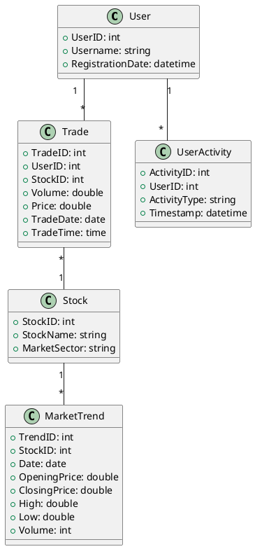

# Robinhood - Likelihood of Trade
### 1. Background
In financial trading platforms like Robinhood, predicting the likelihood of a trade is crucial for offering timely insights and recommendations to users. This involves understanding user behavior, historical trading patterns, and market conditions.

### 2. Problem Description
Design a data model to support the calculation of the likelihood of trade for users based on historical data, user activity, and market trends. The model should facilitate real-time analysis and predictions to enhance user engagement and trading success on the platform.

### 3. Answer: Logical Data Model

#### **Entities and Attributes**
- **User**: Stores basic user information.
  - Attributes: UserID, Username, RegistrationDate, etc.
- **Trade**: Records details about each trade executed by the user.
  - Attributes: TradeID, UserID, StockID, Volume, Price, TradeDate, TradeTime, etc.
- **Stock**: Information about stocks available for trading.
  - Attributes: StockID, StockName, MarketSector, etc.
- **UserActivity**: Tracks user actions within the platform.
  - Attributes: ActivityID, UserID, ActivityType, Timestamp, etc.
- **MarketTrend**: Aggregated market data that might influence trading behaviors.
  - Attributes: TrendID, StockID, Date, OpeningPrice, ClosingPrice, High, Low, Volume, etc.

#### **Relationships**
- A **User** can perform multiple **Trades** (one-to-many).
- A **User** can have multiple **UserActivities** (one-to-many).
- **Trades** are linked to **Stocks** (many-to-one).
- **MarketTrends** relate to **Stocks** (one-to-many).

#### **PlantUML Code**

[data model diagram](http://www.plantuml.com/plantuml/png/XP5DJyCm38Rl-HLMZw0TkEuqn0uWyO5OuHvQQxEMZofnGTFK_qwQRb6w5gq7Itxi-hNVh3nBnwrMmk_9DD993OeCyg51i8vtLeXAIU_XqwE3eu3mtSRaQRq4CfmH8pKkmRCZiptX3znI09B9chNaKAv3PD8eklFaqiaQq-YOJMUFoOPjjH-ZBwlQNhwsxRV24tntL2MM2wHTHhIaVi9ukoW5ntdXX5wdfxz8jqVUOCNMfLANstbVCVqG7zBqCxXoVkeh3ysbQd-2PwcREQU7bKg7fawQCRlgxiIljmPDK9qp-45P_q_faRQx2_HiVnF9Nt9GxuJepuVYhe350egROdYf2Stz5B4buA4Qck958iRyfymFiGgXrUeF)
### How to Use This Model
This logical data model provides a comprehensive schema for analyzing trading behavior on Robinhood. It allows for analyzing individual user trading patterns, their activities on the platform, stock-specific trends, and broader market movements. This setup can be utilized to predict trading likelihood and to generate personalized trading insights.

You can paste the PlantUML code into any PlantUML editor to visualize the data model diagram. This model is crucial for data engineers looking to optimize financial trading platforms by leveraging historical data and real-time market conditions.